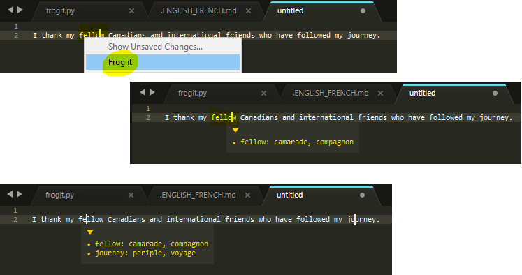

# Frogit
>Sublime Text plugin displaying in a popup the translation of the words selected with multi-cursors. It uses a personnal EN/FR dictionnary file that I maintain. I create this tool to helps me to quickly find EN/FR translations without the hassle to open/search in a dictionnary or personnal notes. Not found translations are appened to my dictionnary file for later manual translation (automatic is planned as the  future development)

## Install

Install it manually: copy files into the package folder. 

## Getting started

From any sublime tab, right-click an english word, then select 'FrogIt' command to get a popup with the french translation.

## License

MIT © [Nicolas Guinet](https://github.com/guinetn/)
